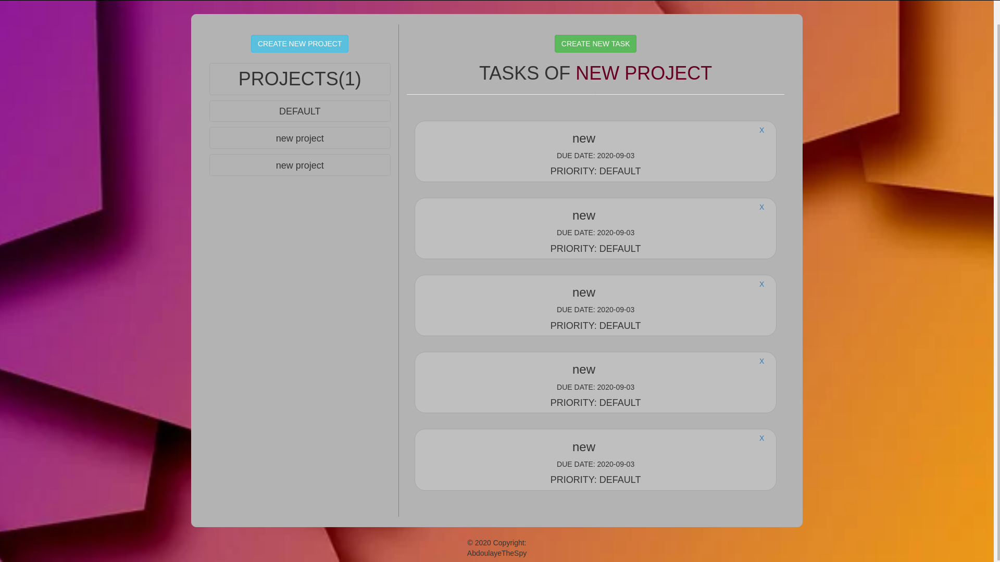
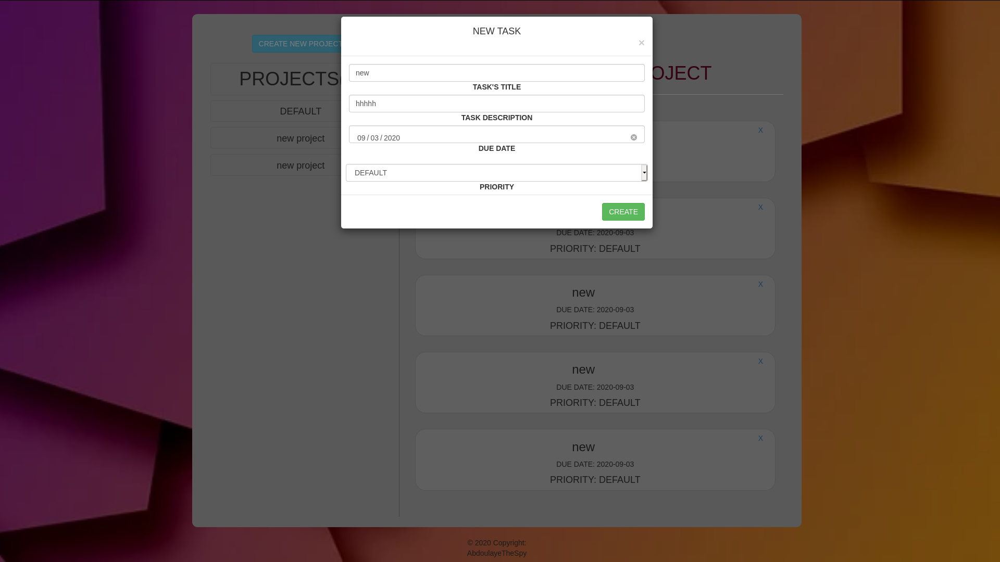
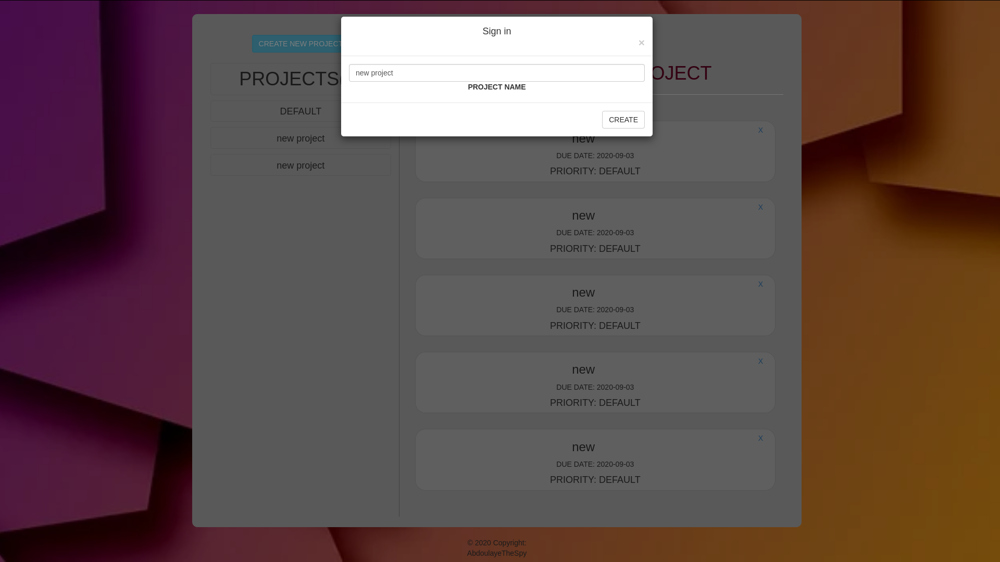

# To-do-list

## [LiveDemo](https://abdoulaye-thespy.github.io/To-do-list/)

## Project description

- As this project is still under reviews the design is not quite it yet.

- This is a to do list Built using javascript and Webpack to bundle multiple files of javascript.
- 
## Screenshots

# Welcome page

# Create Task modal

# Create project modal

## Built with

- HTML5
- CSS3
- JS ES6
- Webpack bundler
- Boostrap

## Getting Started

- Clone the git repository.
- cd into the project
- Open index.html using your prefered browser

## Author

Abdoulaye Njigouh

- Github: [@Abdoulaye](https://github.com/Abdoulaye-Thespy)

## Show your support

Give a ⭐️ if you like this project!
